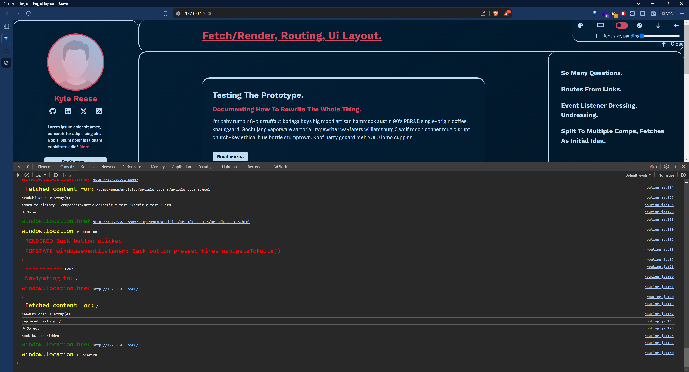

## Prototyping a vanilla blog. Life story in readme.

JavaScript is just an easy scripting language.

#### Is this thing good?
- No it's shit, but I had fun.

#### Does it work?
- Yes.

### Taking frameworks for granted.

- All i wanted is a blog layout in CSS under 150 lines of code on a sunday morning. 
- I couldn't just stop dicking around with it. 

### I needed some answer.
1. Do I need a framework for everything?
2. Do I even need a library like HTMX?
3. Am I just a framework enjoyer (mostly yes), tapping `npm run build` and pretending to know what the hell is going on?

#### Demo with bonus console log disco.

<!-- images -->

## All this stuff included.

- Make it responsive.
- Keep HTML semantics in mind this time. Use aside, nav, header, main, article, footer. Don't do the average frontend thing of "div div div".
- Dynamicly injected routes.
- Keep it SPA.
- Add themes.
- Add lots of totally unnecessary UI features like:
    - Fullscreen
    - Padding
    - Font-size
    - Sticky header on click
    - Toggle element visibilities.
- Keep the above as one function.
- Keep it zero backend, zero dependencies, able to run if pasted into static hosting.
- No localstorage or storage of any kind.
- Keep it HTML only.
- Get own routing sorted with local anchor tags.
- Handle the render logic.
- Handle loading animations.
- No multifetch. Blinking.
- Handle all the event listeners, dressing, undressing elements.
- Add back buttons to page and make it popstate like the browsers back button.
- Swap the heads relevant meta and title tags.
- Search for articles.
- Handle fallbacks like refreshing the page, without multi component fetching...
- Forgot global consts.
- There is no forward button and I'm sure that was intentional just don't know why.
- Hack in a search bar.
- Hide the autocomplete for porn search history not to pop up all the time.
- Tags.. never happened. Got cut with search.
- state management without storage. ---> :D no.
- Catch yourself using try catch blocks to ignore errors like a development 101.
- Cry for React on day 2.